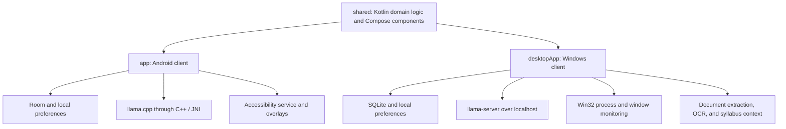

# Anchor

**An Android and Windows planner with local AI, syllabus records, focus timers, and app blocking.**

Anchor combines task planning, calendar-aware scheduling, syllabus extraction, an offline AI runtime, platform-specific app blocking, and persistent progress tracking. It is intended to support starting work and returning to it after an interruption.

**Android + Windows · Kotlin + Compose · Local GGUF inference · Room + SQLite**

[Project case study](docs/project-case-study.md) · [Development and installation](docs/development.md) · [Android blocking rules](docs/mobile-blocking.md)

## From an assignment to a focus session

1. **Capture the work.** Add a task, collect a brain dump, or import course material into the desktop syllabus workspace.
2. **Choose a starting action.** Break work into smaller steps and organize it into tasks, milestones, or a timeline.
3. **Protect the session.** Start a focus timer and apply the configured app or website restrictions.
4. **Return to the plan.** Replan unfinished work, review focus history, and build progress in the garden and harbor screens.

Desktop task breakdown passes the full task text to the model prompt. Relevant pending syllabus records can supply saved deadlines and preparation steps to the AI.

## What the project includes

### An AI workspace for planning

Five planning workflows are implemented: **Break Down**, **Brain Dump**, **Triage**, **Replan**, and **Ask Anchor**. Supported commands such as a timer request can route directly to an action without an extra model-classification request.

The AI runs locally through **llama.cpp**. Windows manages a background `llama-server` process over localhost; Android runs inference through a native **C++/JNI** library. Structured workflows use **GBNF grammars** to constrain the shape of the response. Desktop task breakdown also validates the result and falls back to a task-specific draft when the model is unavailable or returns invalid steps.

These workflows connect to the planner: users can turn a brain dump into tasks, save breakdown steps as milestones, and start a focus session from a suggested action. Android also keeps AI job records and chat history locally. Supported planning changes have a persisted undo stack, including task creation, completion, inbox moves, and scheduling.

### A syllabus workspace with academic context

The desktop client extracts text from **PDF, DOCX, images, and text files**, with a Windows OCR fallback for scanned material. It parses course information and deliverables into records containing dates, item types, weights, and preparation steps.

The workspace includes course filters, completion tracking, an upcoming major-deliverable card, and direct focus-session starts from preparation steps. Exams, projects, homework, and readings receive different preparation templates. These are planning aids based on the item type; review them against the assignment before starting work. The parser does not automatically schedule them.

The AI context selects relevant incomplete items from those saved records by course and date. Supported deadline questions use deterministic answers from the saved dates. Imported text is treated as data, and missing assignment requirements still need the user's input.

### App and window blocking

**Windows:** foreground process and window monitoring, separate executable and browser-title rules, study schedules, usage allowances, rescue windows, earned leisure, and experimental focus-scope classification. Website rules apply to recognized browsers, so a desktop application and a browser tab with the same name keep separate identities. Scope checks run during active focus sessions.

Scope classification combines cached keyword decisions with a local-model fallback. Its default topic policy is tailored to psychology/biology coursework. Browser matching uses window titles, so it is a heuristic rather than URL-level enforcement.

**Android:** an Accessibility service enforces app rules, focus protection, standing shields, overnight curfews, weekday study windows, individual or grouped daily allowances, rule freezes, and a lock until the next local 4 AM. Foreground usage and earned leisure persist across restarts. [Full Android policy and precedence](docs/mobile-blocking.md).

The two clients use separate local data and settings. Android protection operates on apps; desktop website matching and scope classification are platform-specific.

### Planning, recovery, and visible progress

Tasks, assignments, routines, milestones, inbox/someday work, focus timers, and replanning support the work around each session. Android adds several connected systems:

- **Calendar-aware scheduling:** find the next gap that fits a task or a sequence of subtasks, accounting for scheduled work and imported events. Work that cannot fit before the configured shutdown stays unscheduled. Workload calculations merge overlapping time intervals to avoid counting the same busy time twice.
- **A recovery flow:** the Airlock captures a brain dump, parks secondary tasks, selects a primary task and a physical starting action, then starts focus. A deterministic starter is available immediately; local AI can refine it asynchronously, and starting focus cancels that refinement.
- **Habit and reflection tools:** scheduled habits, weekly targets, grace allowances, a 12-week heatmap, energy/tag check-ins, weekly summaries, and planned-versus-actual focus-time statistics.
- **Capture and integrations:** a home-screen widget, share-to-inbox capture, device-calendar occupancy, optional read-only Google Calendar import, and JSON export of tasks, assignments, and calendar records.

The garden, companion, and harbor screens display progress and saved focus rewards using shared Compose drawing/animation components. An Android Filament/SceneView plant renderer is also present as unwired infrastructure; the current shell uses Compose visuals.

## Engineering decisions

- **Deterministic command routing.** Supported commands run without model classification, and desktop breakdown returns a task-specific template when inference cannot complete.
- **Validation beyond output formatting.** The desktop parser checks step counts, empty or duplicate steps, preservation of the first action, and consistency of optional action/time fields. A grammatical response can still be irrelevant, so plans remain reviewable.
- **Context tied to saved records.** Syllabus context is bounded and selected from the same records shown in the desktop workspace, rather than relying on the model to remember course deadlines.
- **Platform-specific enforcement.** Windows uses Win32 APIs through JNA; Android uses Accessibility events and overlays. Shared Kotlin code supplies common domain logic, design components, and progress visuals.
- **A native inference lifecycle.** Android serializes generation, reuses an already loaded model, streams tokens through JNI, supports cancellation, and unloads the warm model after an AI surface has been closed for two minutes. The native layer clears each request's KV cache, rejects invalid grammars instead of silently generating unconstrained JSON, and buffers incomplete UTF-8 token fragments before sending text to Kotlin.
- **Desktop inference configuration.** The client manages server startup, health checks, model changes, and shutdown. Its default CPU profile uses a 2,048-token context, one server slot, quantized KV caches, and disabled reasoning. Memory use and response time depend on the model and hardware.
- **Model asset verification.** Android packages a pinned GGUF asset and verifies its size and SHA-256 before activating the extracted model. The native llama.cpp source archive is pinned and hash-checked too.

A concrete debugging example: an assignment breakdown once copied unrelated prompt examples about dishes and a coding test. That led to changes in task routing, prompts, validation, and regression coverage. The [case study](docs/project-case-study.md) explains the failure, the response, and the remaining limits of semantic validation.

## Architecture



Useful entry points:

- **AI and routing:** [desktop AI module](desktopApp/src/main/kotlin/com/anchor/adhd/desktop/ai), including `DesktopSmartRouter`, `DesktopAiEngine`, and `LlamaServerClient`.
- **Academic context:** [DesktopAcademicContext](desktopApp/src/main/kotlin/com/anchor/adhd/desktop/ai/DesktopAcademicContext.kt) and [DesktopSyllabusParser](desktopApp/src/main/kotlin/com/anchor/adhd/desktop/ai/DesktopSyllabusParser.kt).
- **Windows enforcement:** [DesktopProcessMonitor](desktopApp/src/main/kotlin/com/anchor/adhd/desktop/blocker/DesktopProcessMonitor.kt).
- **Shared domain and UI:** [shared module](shared/src/commonMain/kotlin/com/anchor/adhd).
- **Android native inference:** [C++/JNI runtime](app/src/main/cpp).
- **Android scheduling and undo:** [PlanRepository](app/src/main/java/com/anchor/adhd/data/repository/PlanRepository.kt), [SchedulingSlots](app/src/main/java/com/anchor/adhd/domain/SchedulingSlots.kt), and [ChatUndoManager](app/src/main/java/com/anchor/adhd/domain/ChatUndoManager.kt).
- **Recovery and progress:** [AnchorViewModel](app/src/main/java/com/anchor/adhd/ui/vm/AnchorViewModel.kt), [HabitScoreCalculator](app/src/main/java/com/anchor/adhd/domain/HabitScoreCalculator.kt), and [GrowRepository](app/src/main/java/com/anchor/adhd/data/repository/GrowRepository.kt).

## Run the desktop client

Use **JDK 17** and an Android SDK configured in your ignored `local.properties`; the repository includes Android modules even when running desktop tasks. Detailed prerequisites and Android build steps are in the [development guide](docs/development.md).

```powershell
git clone https://github.com/chentaot1/anchor-adhd.git
cd anchor-adhd
.\gradlew.bat :desktopApp:test
.\gradlew.bat :desktopApp:run
```

Desktop unit tests do not require model weights. To enable local AI, configure a compatible `llama-server.exe` and a GGUF file in Settings. Build a Windows application image with `:desktopApp:createDistributable`; `Launch-Anchor.bat` starts that image when available and otherwise uses Gradle.

Models, runtime binaries, build outputs, credentials, and personal databases are excluded from Git. The Android package bundles a large model; the source repository does not contain those weights.

## Validation and current status

The desktop suite passed **92 tests with zero failures, errors, or skips on October 2, 2026**. Coverage includes task routing, breakdown parsing, syllabus relevance and deadlines, app-versus-website identity, blocker policies, persistence, and platform helpers.

```powershell
.\gradlew.bat :desktopApp:test
.\gradlew.bat :app:testDebugUnitTest
```

[Android CI](.github/workflows/android-build.yml) runs Android unit tests. APK publication is an opt-in tagged-release workflow. The desktop result above was verified locally; desktop tests are not currently part of that CI workflow.

Anchor is a personal project under development. Current desktop fixes require rebuilding an older installation. Generated plans and extracted syllabus dates need review, and native blocking still needs testing on the target devices. Scope classification is experimental and may produce false positives. There are no established learning-outcome or clinical efficacy claims.

## Further reading

- [Project case study](docs/project-case-study.md): motivation, tradeoffs, debugging, verification, and remaining work.
- [Development and installation](docs/development.md): SDK setup, desktop packaging, Android model bundling, and updates.
- [Android app protection](docs/mobile-blocking.md): rule precedence, daily reset, allowances, and earned leisure.
- [Android inference implementation](docs/desktop-model-on-android.md): pinned model, JNI behavior, host verification, and pending device checks.
- [Earlier product specification](FULL_APP.md): broader design intent; some details predate the current implementation.

## License

Anchor's original source code and documentation are licensed under the [MIT License](LICENSE). Third-party libraries, assets, and model weights retain their respective licenses and terms.
