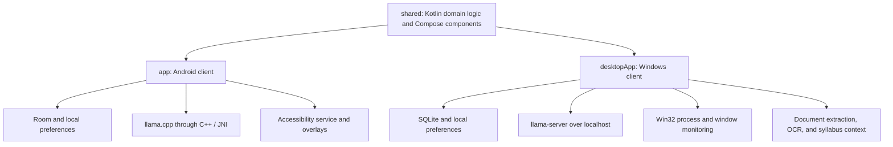

# Anchor

**A local AI planner that connects schoolwork, a manageable next action, and a protected focus session.**

Anchor is an Android and Windows application built around a familiar student problem: knowing what needs to get done, but struggling to start or return after a distraction. It combines task planning, syllabus records, local language models, native app blocking, and visual progress in one workflow.

**Android + Windows · Kotlin + Compose · Local GGUF inference · Room + SQLite**

[Project case study](docs/project-case-study.md) · [Development and installation](docs/development.md) · [Android blocking rules](docs/mobile-blocking.md)

## From an assignment to a focus session

1. **Capture the work.** Add a task, collect a brain dump, or import course material into the desktop syllabus workspace.
2. **Choose a starting action.** Break work into smaller steps and organize it into tasks, milestones, or a timeline.
3. **Protect the session.** Start a focus timer and apply the configured app or website restrictions.
4. **Return to the plan.** Replan unfinished work, review focus history, and build progress in the garden and harbor screens.

For example, a task such as “complete CHIN 103 written assignments” should retain its course and assignment details throughout routing and planning. On desktop, relevant pending syllabus records can supply saved deadlines and preparation steps to the AI.

## What the project includes

### An AI workspace for planning

Five core workflows are implemented: **Break Down**, **Brain Dump**, **Triage**, **Replan**, and **Ask Anchor**. Natural commands such as a timer request can route directly to an action without an extra model-classification request.

The AI runs locally through **llama.cpp**. Windows manages a background `llama-server` process over localhost; Android runs inference through a native **C++/JNI** library. Structured workflows use **GBNF grammars** to constrain the shape of the response. Desktop task breakdown also validates the result and falls back to a task-specific draft when the model is unavailable or returns invalid steps.

### A syllabus workspace with academic context

The desktop client extracts text from **PDF, DOCX, images, and text files**, with a Windows OCR fallback for scanned material. It parses course information and deliverables into records containing dates, item types, weights, and preparation steps.

The AI context selects relevant incomplete items from those saved records by course and date. Supported deadline questions use deterministic answers from the saved dates. Imported text is treated as data, and missing assignment requirements still need the user's input.

### Native distraction protection

**Windows:** foreground process and window monitoring, separate executable and browser-title rules, study schedules, usage allowances, rescue windows, earned leisure, and experimental focus-scope classification. Website rules apply to recognized browsers, so a desktop application and a browser tab with the same name keep separate identities. Scope checks run during active focus sessions.

**Android:** an Accessibility service enforces app rules, focus protection, standing shields, overnight curfews, weekday study windows, individual or grouped daily allowances, rule freezes, and a lock until the next local 4 AM. Foreground usage and earned leisure persist across restarts. [Full Android policy and precedence](docs/mobile-blocking.md).

The two clients use separate local data and settings. Android protection operates on apps; desktop website matching and scope classification are platform-specific.

### Planning, recovery, and visible progress

Tasks, assignments, routines, milestones, inbox/someday work, focus timers, and replanning support the work around each session. The garden, companion, and harbor screens give progress a visual form. Android also includes a home-screen widget, share-to-inbox capture, backup export, and optional read-only Google Calendar import.

## Engineering decisions

- **Fast actions before model inference.** Deterministic routing handles supported commands, and desktop breakdown has a usable draft when inference cannot complete.
- **Validation beyond output formatting.** The desktop parser checks step counts, empty or duplicate steps, preservation of the first action, and consistency of optional action/time fields. A grammatical response can still be irrelevant, so plans remain reviewable.
- **Context tied to saved records.** Syllabus context is bounded and selected from the same records shown in the desktop workspace, rather than relying on the model to remember course deadlines.
- **Platform-specific enforcement.** Windows uses Win32 APIs through JNA; Android uses Accessibility events and overlays. Shared Kotlin code supplies common domain logic, design components, and progress visuals.
- **Verified offline model installation.** Android packages a pinned GGUF asset and verifies its size and SHA-256 before activating the extracted model. The native llama.cpp source archive is pinned and hash-checked too.

A concrete debugging example: an assignment breakdown once copied unrelated prompt examples about dishes and a coding test. That led to changes in task routing, prompts, validation, and regression coverage. The [case study](docs/project-case-study.md) explains the failure, the response, and the remaining limits of semantic validation.

## Architecture



Useful entry points:

- **AI and routing:** [desktop AI module](desktopApp/src/main/kotlin/com/anchor/adhd/desktop/ai), including `DesktopSmartRouter`, `DesktopAiEngine`, and `LlamaServerClient`.
- **Academic context:** [DesktopAcademicContext](desktopApp/src/main/kotlin/com/anchor/adhd/desktop/ai/DesktopAcademicContext.kt) and [DesktopSyllabusParser](desktopApp/src/main/kotlin/com/anchor/adhd/desktop/ai/DesktopSyllabusParser.kt).
- **Windows enforcement:** [DesktopProcessMonitor](desktopApp/src/main/kotlin/com/anchor/adhd/desktop/blocker/DesktopProcessMonitor.kt).
- **Shared domain and UI:** [shared module](shared/src/commonMain/kotlin/com/anchor/adhd).
- **Android native inference:** [C++/JNI runtime](app/src/main/cpp).

## Run the desktop client

Use **JDK 17** and an Android SDK configured in your ignored `local.properties`; the repository includes Android modules even when running desktop tasks. Detailed prerequisites and Android build steps are in the [development guide](docs/development.md).

```powershell
git clone https://github.com/chentaot1/anchor-adhd.git
cd anchor-adhd
.\gradlew.bat :desktopApp:test
.\gradlew.bat :desktopApp:run
```

Desktop unit tests do not require model weights. To enable local AI, configure a compatible `llama-server.exe` and a GGUF file in Settings. Build a Windows application image with `:desktopApp:createDistributable`; `Launch-Anchor.bat` starts that image when available and otherwise uses Gradle.

Models, runtime binaries, build outputs, credentials, and personal databases are excluded from Git. The Android package bundles a large model; the source repository does not contain those weights.

## Validation and current status

The desktop suite passed **92 tests with zero failures, errors, or skips on October 2, 2026**. Coverage includes task routing, breakdown parsing, syllabus relevance and deadlines, app-versus-website identity, blocker policies, persistence, and platform helpers.

```powershell
.\gradlew.bat :desktopApp:test
.\gradlew.bat :app:testDebugUnitTest
```

[Android CI](.github/workflows/android-build.yml) runs Android unit tests. APK publication is an opt-in tagged-release workflow. The desktop result above was verified locally; desktop tests are not currently part of that CI workflow.

Anchor is a working personal project under active development. Current desktop fixes require rebuilding an older installation. Generated plans and extracted syllabus dates need review, and native blocking still needs testing on the target devices. Scope classification is experimental and may produce false positives. There are no established learning-outcome or clinical efficacy claims.

## Further reading

- [Project case study](docs/project-case-study.md): motivation, tradeoffs, debugging, verification, and remaining work.
- [Development and installation](docs/development.md): SDK setup, desktop packaging, Android model bundling, and updates.
- [Android app protection](docs/mobile-blocking.md): rule precedence, daily reset, allowances, and earned leisure.
- [Android inference implementation](docs/desktop-model-on-android.md): pinned model, JNI behavior, host verification, and pending device checks.
- [Earlier product specification](FULL_APP.md): broader design intent; some details predate the current implementation.
